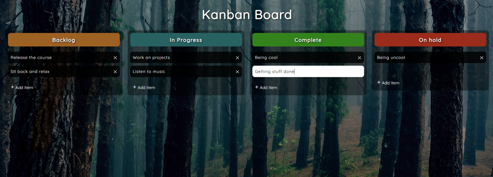

# Drag and Drop

This project demonstrates a simple yet powerful drag-and-drop interface built using vanilla JavaScript, HTML, and CSS. The goal is to gain hands-on experience with DOM manipulation and custom event handling without relying on external libraries.

## Project Features

- Custom drag-and-drop logic using native JavaScript
- Visual feedback for draggable items and drop zones
- Smooth transitions when items are moved
- Fully responsive layout
- Simple editing and removing of tasks
- No third-party libraries – just **HTML**, **CSS**, and **JavaScript**
## Preview

[demo](https://abdo-rabea.github.io/drag-and-drop/)

## What You'll Learn

- Handling `dragstart`, `dragover`, `drop`, and other drag events
- Dynamically updating the DOM
- Working with `dataTransfer` API
- Creating a responsive layout with CSS Flexbox
- Enhancing user interaction with animations and visual cues

## Tech Stack

- **HTML5**
- **CSS3**
- **JavaScript (ES6+)**
